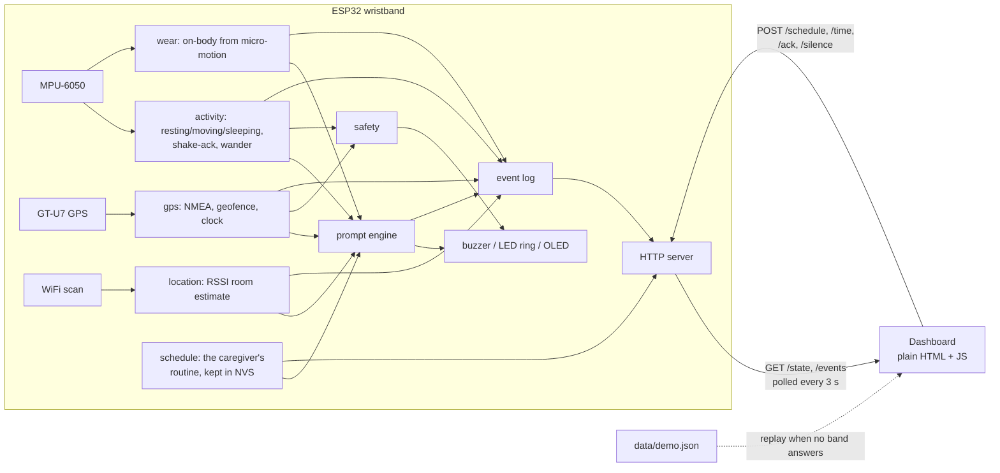

# Brain Buddy

**A $30 wristband that helps someone with dementia keep their own routine, and tells one caregiver when it didn't work. It runs entirely on the home WiFi — no account, no cloud, no subscription, and nothing about the person leaves the house.**

The products sold to families for this cost $30–$50 every month, need their own phone plan, and stream a person's location to someone else's server. I wanted the opposite. Brain Buddy costs about one month of that, once. The dashboard talks to the band over the home network and to nothing else. And the device is built to ask the person to do something, not to report on them.

That distinction runs all the way down into the firmware. The buzzer duty cycle is capped so it chimes instead of alarming. The band nudges someone wandering at 3am exactly once, because waking them fully is worse than the wander. When it decides the person has left the safe area it shows them the direction home before it tells anyone else. I would rather ship a device someone is willing to keep wearing than one that is technically more informative.

## Why this matters

Forgetting medication is not the thing that puts people in care. Losing the ability to run your own day is. The gap that Brain Buddy sits in is small and specific:

- **A reminder that arrives where it can be acted on.** A 9am alarm for pills that are in the kitchen is useless in the bedroom. Brain Buddy holds that reminder until the band's room estimate says kitchen, or until 30 minutes have passed. It also holds the whole routine while the person is out of the house, because a reminder to eat lunch during a walk just teaches someone to ignore the buzzing.
- **Proof it happened, not a guess.** The band only counts a reminder as done when the person shakes their wrist. No shake inside the response window means the caregiver sees "not acknowledged" — an honest answer, rather than a notification that was technically delivered.
- **One caregiver, one page, no monitoring room.** The dashboard shows today's routine, the notices that need attention, and where the band is. That is the whole surface area.
- **Voice, both ways.** Whoever is caring can leave a spoken message that plays on the dashboard, and the person can answer in their own voice. Reading gets hard before speaking does.

## What it does

| | |
|---|---|
| **Reminders** | Times a caregiver sets on the dashboard. The band chimes, shows the words on its screen, and waits 60 seconds for a shake. It re-chimes once, then records a miss. |
| **Acknowledgement** | A shake of the wrist. A caregiver standing in the room can also tick it off from the dashboard. |
| **Room estimate** | Which room the band is in, from WiFi signal strength. Used to hold a reminder until it is useful. It is an estimate, and the dashboard shows its confidence rather than pretending otherwise. |
| **On the wrist or not** | Inferred from the IMU: a worn device always shows micro-motion, a device on a table is dead still. There is no skin electrode in the parts list. |
| **Away from home** | A GPS geofence. The band chimes and shows the distance and compass direction home; the caregiver gets a notice they can act on. |
| **Night wandering** | Movement between midnight and 5am. One quiet nudge on the wrist, one notice on the dashboard. |
| **Voice messages** | Recorded in the browser, stored locally in SQLite, with optional speech-to-text the sender can correct before sending. |

## Running it

Three pieces, and you only need the first one to see the dashboard.

```sh
# 1. The dashboard and voice messages (Python 3, no packages).
python3 tools/message_server.py
# open http://127.0.0.1:8787/

# 2. With a real band on the same network, append its IP:
# http://127.0.0.1:8787/?device=192.168.1.42

# 3. The firmware.
cd firmware && pio run -t upload && pio device monitor
# the band prints its IP at boot
```

With no band on the network the dashboard replays `docs/data/demo.json`, a real session recorded off the hardware with `tools/capture_demo.py`. That is also what the GitHub Pages copy serves, because Pages is HTTPS and browsers will not let an HTTPS page talk to a device at `http://192.168.x.x`. The split is not a workaround I am apologising for — it is the "no cloud" claim being literally true.

Before a demo in a new building, two things are measurements rather than settings and have to be retaken on site:

```sh
python3 tools/fingerprint_trainer.py <band-ip> --rooms kitchen bedroom --write   # room table
python3 tools/test_device_http.py <band-ip> --set-time --fire                    # end-to-end check
```

Venue WiFi often has client isolation, which stops the laptop and the band from seeing each other on the same SSID. A phone hotspot fixes it. Budget twenty minutes for this.

## How it fits together



Every firmware module is `init()` + `tick()` + getters, called in a fixed order from one single-threaded loop. Modules only reach each other through a shared `DeviceState` and the event log — nothing in `gps.cpp` knows the buzzer exists.

The arrow that matters most is the one going back to the band. The routine a caregiver builds on the dashboard is pushed to the wristband over `POST /schedule` and kept in NVS, so it survives a flat battery. The dashboard is the source of truth for what the band reminds about; `config.h` only holds the fallback routine for a band nobody has set up yet. The dashboard also sets the band's clock, because the ESP32 has no battery-backed one and until something tells it the time it looks perfectly alive while firing no reminders at all.

### The data contract

Both halves are built against this, and `tools/contract.py` checks it without needing a device.

`GET /state`
```json
{ "ts": 1758290400, "activity": "moving", "room": "kitchen", "roomConfidence": 82,
  "worn": true, "wanderFlag": false, "awayFromHome": false, "pendingPrompt": null,
  "gps": { "fix": true, "sats": 9, "lat": 42.3601, "lon": -71.0942,
           "distanceHomeM": 12, "heading": "NW" } }
```

`GET /events?since=41`
```json
{ "events": [
  { "id": 42, "ts": 1758290400, "type": "prompt_fired", "detail": "meds_9am" },
  { "id": 43, "ts": 1758290421, "type": "prompt_acked", "detail": "meds_9am" },
  { "id": 46, "ts": 1758291600, "type": "geofence_exit", "detail": "210m" }
]}
```

`GET /schedule` — what the band is running. Its own output is a valid body for the POST, which is what makes "read it back and check" possible.
```json
{ "source": "dashboard", "max": 24,
  "items": [ { "id": "meds_9am", "label": "Medication", "hour": 9, "minute": 0, "room": "kitchen" } ] }
```

| Endpoint | Purpose |
|---|---|
| `GET /state` | current state |
| `GET /events?since=<id>` | event log after `<id>`; ring buffer of 200, RAM only |
| `GET /schedule` | the routine the band is running |
| `POST /schedule` | replace it. All-or-nothing: a body that fails to parse leaves the old routine running and answers with the reason |
| `POST /ack` | tick off the pending reminder from the dashboard (409 if none) |
| `POST /silence` | stop the away-from-home chime, keep the notice |
| `POST /time?epoch=<n>` | set the clock |
| `POST /demo/fire?id=<id>` | fire a reminder now, so a demo never waits on the clock |
| `GET /scan` | raw WiFi scan, for the fingerprint trainer |

Event vocabulary, complete: `prompt_fired`, `prompt_acked`, `prompt_missed`, `wear_on`, `wear_off`, `room_change`, `wander`, `geofence_exit`, `geofence_return`, `schedule_set`.

Without a GPS fix, `gps.fix` is `false` and the position fields are `null` — never a stale coordinate. `awayFromHome` keeps its last value, because losing GPS is not the same as coming home.

## Repo

```
docs/            the dashboard; also the GitHub Pages root
  js/api.js        reads the band, or replays demo.json - the only file that knows which
  js/device.js     writes to the band: routine push, acknowledge, silence
  js/checklist.js  the routine and its state
  js/clock.js  js/progress.js  js/timeline.js  js/alerts.js  js/location-map.js
  js/messages.js   voice messages
  data/demo.json   a recorded session, replayed when no band answers
firmware/src/
  schedule.{h,cpp} the caregiver's routine: parse, validate, persist to NVS
  prompts.{h,cpp}  the product: schedule, gating, the 60-second ack window
  activity  location  gps  wear     sensing
  safety  buzzer  leds  display     what the person sees and hears
  events  server                    the log and the HTTP contract
hardware/        bill of materials and wiring, with the traps called out
tools/           contract checks, device tests, demo capture, fingerprint trainer
```

## Testing

```sh
python3 tools/contract.py                      # contract, no device needed
cd firmware && pio test -e native              # 132 logic tests on your laptop, ~6 s
pio run                                        # all four build configurations compile
pio test -e esp32dev                           # wiring, sensors, timing - needs the board
python3 tools/test_device_http.py <ip> --fire --schedule   # the live HTTP contract
```

The native tests compile the real `src/*.cpp` against fakes in `test/mocks/` — a fake IMU, a fake WiFi scanner, a fake GPS UART that the tests feed real NMEA sentences with correct checksums. Time moves with `mock::advance(ms)`. See `firmware/test/README.md`.

Three features can be cut to a build flag if hardware fails, each with its own build environment so `pio run` proves the cut still compiles before anyone needs it:

| Cut | Flag | What survives |
|---|---|---|
| Wear estimate | `-DENABLE_WEAR=0` | everything else |
| Room estimate | `-DENABLE_LOCATION=0` | reminders become time-only |
| GPS and geofence | `-DENABLE_GPS=0` | the full reminder loop; the clock comes from the dashboard |

The reminder loop — chime, shake, dashboard — has no cut. If that does not work there is no product.

## Cost

About **$30** in parts: ESP32 DevKit, MPU-6050, GT-U7 GPS, SSD1306 OLED, a 12-pixel NeoPixel ring, a piezo buzzer. Itemised in [`hardware/bom.md`](hardware/bom.md), wiring and its traps in [`hardware/wiring.md`](hardware/wiring.md). One month of a commercial tracking subscription, and then nothing.

## What I know is missing

- **The event log does not survive a reboot.** 200 events in RAM. The routine does persist, in NVS.
- **The room estimate is a guess.** It needs retraining whenever a router moves, and two rooms that hear the same access points at the same strength cannot be told apart — the trainer says so out loud rather than producing a table that quietly does not work.
- **Nothing is authenticated.** Anyone on the home WiFi can read the band and push a routine to it. That is a deliberate trade for a device with no account and no cloud, and it is the first thing I would change before this went into a real house.
- **Weekly progress lives in one browser.** It is per-device history, not a record, and a blank day means no data rather than a missed day.
- **The voice message server is a demo.** No sign-in; anyone who can reach it can send as either person.

Next, in order: sign the dashboard-to-band connection, persist the event log to flash, and let a caregiver set a reminder's room from the dashboard instead of only its time — the firmware already accepts the field, the editor just does not offer it yet.
