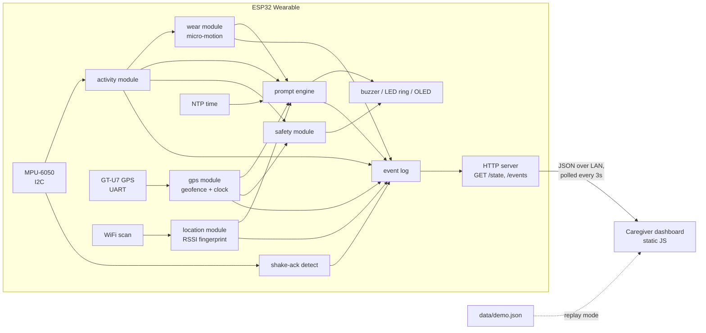

# Granny Nanny — Build Spec

Granny Nanny's brain mascot is named **Brain Buddy**.

In Patient view, Brain Buddy sits below the demo toggle and shows the caregiver’s latest voice message and transcription. The patient’s recording area comes next, followed by today’s routine clock and weekly progress. Brain Buddy is hidden in Caregiver view, which retains the full recent message history.

The clock displays 12 sample activities from 8 AM through 7 PM, with AM/PM labels on each symbol. These are dashboard schedule entries; actual bracelet prompts are configured separately in the firmware. Received and missed states update when matching prompt events arrive.

In **Caregiver** view, **For caregivers** shows an interactive street map with pan/zoom, a bracelet marker, GPS accuracy circle, recenter control, and a link to open the coordinates in Google Maps. The map uses locally bundled [Leaflet 1.9.4](https://leafletjs.com/) with [OpenStreetMap](https://www.openstreetmap.org/copyright) street tiles. No map API key is needed. Street tiles require internet access; they use normal browser caching and are not downloaded for offline use. Location details remain readable if tiles fail. Tiles only load when the caregiver map is visible.

**GPS is a frontend integration, not yet provided by the firmware.** The replay fixture includes explicitly simulated coordinates near MIT for demonstrating the map. Room estimates cannot determine a street position, and the site never uses the browser’s own location as the bracelet’s. Missing or invalid coordinates show no marker; old GPS timestamps are labeled as last reported. Off-wrist status refers to the bracelet rather than the person.

To connect real GPS, add this object to the bracelet’s `/state` response (example values only):

```json
"gps": { "latitude": 42.3601, "longitude": -71.0942, "accuracy": 25, "ts": 1758290400 }
```

`latitude` and `longitude` are numeric degrees; `accuracy` is an optional radius in meters. `ts` is the GPS fix’s Unix timestamp in seconds (the state’s `ts` is the fallback). Send `gps: null` or `valid: false` inside `gps` when there is no fix. Do not refresh the fix timestamp unless GPS supplies a new measurement. The demo fixture’s `demo: true` flag is rejected in live mode. Existing `room`, `worn`, and room/wrist events still update the text below the map.

## Voice messages

Run the local message server with Python 3. Use the **Patient / Caregiver** buttons near the top of the page to switch demo views. One patient and one caregiver are created automatically; there is no account setup, password, PIN, or sign in. Record a voice message, preview it, and send it, then switch views to hear it as the recipient. Caregiver view also shows contact settings, notices, and device activity. Unsent recording previews are kept for each role during the page visit; switching while recording stops that unfinished recording. Each tab remembers its own selected view, so two tabs can demonstrate a conversation.

New microphone recordings include speech to text when the browser supports the Web Speech API. The browser's speech service may process audio online; the recording form explains this and provides an audio-only option. Review and edit the words before sending. Audio and the edited transcript are saved together in SQLite and shown in both views. Existing databases are upgraded automatically. Browsers without speech recognition support provide a field for typing the words after recording. Voice messages are recorded with the microphone; file uploads are not offered. Speech recognition can fail or miss words, so the original recording stays available. See [browser speech recognition support](https://developer.mozilla.org/en-US/docs/Web/API/SpeechRecognition).

```sh
python3 tools/message_server.py
```

Open `http://127.0.0.1:8787/`. For a live wristband, append `?device=ESP32_IP`. Participants, recordings, and transcripts are stored in the local SQLite file `var/voice_messages.sqlite3`; previous recordings are preserved. This is a demo without authentication: anyone who can access the server can view and send messages as either role. The database is ignored by Git. To use separate devices, host this server on a trusted HTTPS connection using `VOICE_HOST`, `VOICE_TLS_CERT`, and `VOICE_TLS_KEY`; browsers require a secure context for microphone recording. The static page still shows the routine but cannot send or receive messages without the server.

The page follows the browser's default text size. Clock symbols show reminder status with colors and accessible labels; there is no separate morning routine reminder box or text-size control. The clock has a **Weekly progress** tab with seven vertical stacked bars (purple for received, red for missed, amber for unconfirmed) on a shared count axis. It summarizes only `prompt_fired`, `prompt_acked`, and `prompt_missed` events the browser has observed. Live history is stored in that browser for up to 45 days; replay history is kept separate and resets when replay starts. A blank day means there is no recorded data, not that the person missed every task. A caregiver can add or change a trusted name and phone number in **For caregivers**; the page then shows a one-tap call link near the top. The contact is stored in that browser only.

ESP32 wearable for people with dementia/TBI. Gentle haptic prompts tied to time + room-level location, with a caregiver dashboard and local voice messaging. ~$15 of parts for the original wearable prototype, excluding the message server.

---

## 1. System architecture



One integration seam matters more than everything else: **the JSON contract between firmware and dashboard** (§5). Freeze it in the first hour; both halves build against it independently.

**GitHub Pages constraint (important):** Pages is static hosting over HTTPS. It cannot receive POSTs from the ESP32, and an HTTPS page is blocked by browsers from fetching `http://<esp32-ip>` (mixed content / private network access). So the dashboard is one set of static files running in two modes:

- **Live mode** — same files opened locally (`python -m http.server` or the repo checkout) during the demo, polling the ESP32 over the LAN via HTTP. This is what judges see live.
- **Replay mode** — the GitHub Pages deployment, which loads `data/demo.json` (a captured event log) and animates it. This is what judges see when they open the link later. Auto-fallback: if the ESP32 fetch fails, switch to replay and show a banner.

This split is a feature, not a hack — it's literally the "local, no cloud" pitch. Say so on the slide.

---

## 2. Repo layout

```
granny-nanny/
├── README.md                  # pitch summary, wiring photo, quickstart, link to Pages
├── docs/                      # ← GitHub Pages root (Settings → Pages → main /docs)
│   ├── index.html
│   ├── css/style.css
│   ├── js/
│   │   ├── api.js             # data source abstraction: live vs replay
│   │   ├── app.js             # boot, poll loop, mode switching
│   │   ├── checklist.js       # today's routine checklist
│   │   ├── timeline.js        # activity/room timeline strip
│   │   └── alerts.js          # alert feed (wander, removal, missed prompt)
│   ├── data/demo.json         # captured event log for replay mode
│   └── img/                   # wiring diagram, photos (shared with README)
├── firmware/
│   ├── platformio.ini
│   └── src/
│       ├── main.cpp           # setup + single tick loop
│       ├── config.h           # WiFi creds, pins, schedule, fingerprints, home location
│       ├── state.h            # DeviceState (the shared types)
│       ├── activity.{h,cpp}   # resting/moving/sleeping + wander flag + shake-ack
│       ├── location.{h,cpp}   # RSSI room fingerprinting (stubbable)
│       ├── gps.{h,cpp}        # NMEA parse, geofence, clock fallback (stubbable)
│       ├── wear.{h,cpp}       # on-body estimate from IMU micro-motion (stubbable)
│       ├── prompts.{h,cpp}    # scheduler + gating logic
│       ├── safety.{h,cpp}     # away/wander -> chime, ring, screen
│       ├── buzzer.{h,cpp}     # piezo tone patterns
│       ├── leds.{h,cpp}       # NeoPixel ring status modes
│       ├── display.{h,cpp}    # OLED
│       ├── events.{h,cpp}     # ring-buffer event log
│       └── server.{h,cpp}     # HTTP endpoints + CORS
├── hardware/
│   ├── wiring.md              # pin table + Fritzing/hand-drawn diagram
│   ├── bom.md                 # parts + cost (the "$15" claim, itemized)
│   └── enclosure/             # STL or "cardboard + tape" photos
├── tools/
│   ├── fingerprint_trainer.py # serial capture: label RSSI scans per room → config.h table
│   └── capture_demo.py        # poll /events during a real run → docs/data/demo.json
└── pitch/
    └── slides.pdf
```

---

## 3. Firmware modules

Single-threaded `loop()` with `millis()` timers. No RTOS tasks, no interrupts beyond what libraries need. Every module exposes `init()` + `tick()` + a getter; `main.cpp` owns a global `DeviceState` and calls modules in a fixed order.

### state.h (shared types — write this first)
```cpp
enum Activity { SLEEPING, RESTING, MOVING };
enum Room { UNKNOWN, KITCHEN, BEDROOM, LIVING };  // match config table

struct DeviceState {
  Activity activity;
  Room room;
  uint8_t roomConfidence;   // 0–100, for the demo slide
  bool worn;                // inferred from IMU micro-motion, not an electrode
  bool wanderFlag;          // motion 00:00–05:00
  int8_t pendingPrompt;     // index into SCHEDULE, -1 = none

  bool fix;                 // GPS
  uint8_t sats;
  double lat, lon;
  float distanceHomeM;      // < 0 = unknown
  bool awayFromHome;        // outside the geofence, debounced
};

struct Event {
  uint32_t id;              // monotonic
  time_t ts;
  const char* type;         // see event vocabulary §5
  const char* detail;
};
```

### activity — accelerometer classification
- I2C accel (MPU-6050 class assumed; adjust if different).
- 10 Hz sampling, 5 s sliding window of movement magnitude (|a| − 1g, filtered).
- Thresholds: below T1 for 20+ min → `SLEEPING`; below T1 → `RESTING`; above T1 → `MOVING`. Tune T1 on-wrist, hardcode.
- Wander flag: `MOVING` between 00:00–05:00 → emit `wander` event (once per episode, 30 min cooldown).
- **Shake-ack**: 3+ high-magnitude peaks within 1.5 s → `ackDetected()` returns true. Lives here because it owns the accel; prompt engine consumes it.

### location — RSSI fingerprinting *(stubbable — see cut order)*
- Every 15 s: `WiFi.scanNetworks()`, build vector of {BSSID → RSSI} for the 5–8 strongest APs.
- Match against per-room reference vectors in `config.h` (captured with `tools/fingerprint_trainer.py`): nearest neighbor, Euclidean distance over shared BSSIDs, missing AP = −100 dBm.
- Require margin between best and second-best match, else hold previous room. Debounce: 2 consecutive agreeing scans before emitting `room_change`.
- **Stub**: `getRoom()` returns `UNKNOWN`; prompt engine's location gate auto-passes when room is `UNKNOWN`. This makes the fallback (time-only prompts) a config behavior, not a code rewrite.
- Accuracy caveat for slides: this is room-*guess*, not room-*truth*. Say "room-level estimate," show the confidence number, don't claim precision you haven't measured.

### gps — position, geofence, and the clock
- GT-U7 on UART2 at 9600 baud. Hand-rolled NMEA parser (no library): `GGA` for fix/sats/position, `RMC` for UTC date + time. Checksums are verified; a bad sentence is dropped, not guessed at.
- **Geofence**: haversine distance from `HOME_LAT`/`HOME_LON`. Leaving takes the full `GEOFENCE_RADIUS_M`, returning takes `RADIUS − HYST`, and either way 3 consecutive fixes must agree — GPS jitter at the boundary is the failure mode, not the fence. Emits `geofence_exit` / `geofence_return` with the distance in the detail field.
- **Clock fallback**: if NTP is blocked at the venue (it often is), the first valid `RMC` sets the RTC. This removes the demo's single worst dependency; `POST /time` stays as a third fallback.
- Fixes go stale after 15 s of silence: `fix` drops to false rather than the dashboard showing a position from ten minutes ago.
- No fix (indoors, cold start) is a normal state: no geofence, everything else runs.

### wear — is it actually on the wrist *(stubbable)*
- No electrode in this BOM. Wear is inferred from the IMU: a strapped-on device always shows micro-motion (breathing, pulse, drift); a device on a nightstand is dead still.
- Above `WEAR_MICRO_G` for 3 s → worn. Dead still for 5 min → not worn. Emits `wear_on` / `wear_off`.
- No IMU answer → fail open (`worn = true`), so a dead sensor never mutes the day's prompts.
- Slide language: "not detected on body", never "removed". `test_imu_noise_floor_is_below_the_wear_threshold` on the device checks this board's noise floor actually sits under the threshold.

### prompts — the product
- Schedule table in `config.h`: `{hour, minute, label, requiredRoom (or ANY), gate}`.
- Gate logic per tick: time reached AND `worn` AND `activity != SLEEPING` AND **not** `awayFromHome` AND (room matches OR requiredRoom == ANY OR room == UNKNOWN-with-stub).
- Fire → `buzzerGentle()`, ring turns amber, label goes on the OLED, set `pendingPrompt`, emit `prompt_fired`, start 60 s ack window.
- Shake within window → `prompt_acked` (ring flashes green, OLED says "Done!"). Timeout → re-chime once, then `prompt_missed` (dashboard alert). Hold-if-not-worn / away: hold the prompt until they are back and wearing it, up to 30 min.
- `POST /demo/fire` forces a prompt (demo insurance); `POST /ack` lets the caregiver tick one off from the dashboard.

### buzzer — piezo
- Passive piezo on `PIN_BUZZER`, driven with LEDC tones; patterns are `{frequency, ms}` note lists played by a non-blocking sequencer.
- `GENTLE` (two rising notes), `REMIND` (three notes, louder), `ALERT` (two-tone, away from home), `ACK` (short blip). Duty is volume: all patterns sit under 25% of a square wave's maximum, so it is a chime, not an alarm — the "gentle" in the pitch is a firmware constant.
- `BUZZER_PASSIVE 0` switches to an active buzzer (on/off only); the patterns then play as rhythm.

### leds — NeoPixel ring
- One mode chosen per frame from `DeviceState`, in priority order: temporary flash > boot > alert (away or wandering) > prompt pending > acknowledged > off-body > asleep > idle.
- Boot chase while WiFi comes up, amber comet for a waiting prompt, red pulse for an alert, green wash on ack, a dim warm glow as a night light while asleep.
- Brightness is capped at `LED_BRIGHTNESS 40`: it is worn at night, and 12 pixels at full white draw more current than USB provides.

### safety — the alert responder
- Sensors stay sensors: nothing in `gps.cpp` or `activity.cpp` knows the buzzer exists. `safety.cpp` watches `awayFromHome` and `wanderFlag` and produces the on-wrist response.
- Leaving home: chime + red ring + OLED showing distance and compass direction home ("Home 210m SW"), repeated every 2 min, at most 5 times — then it stops nagging, because the caregiver already has the alert.
- Night wandering: one quiet nudge on a 5 min cooldown. Waking someone fully at 3am is worse than the wander.
- `POST /silence` stops the chime without clearing the alert.

### events
- Ring buffer, 200 entries, monotonic `id`. `since=<id>` query support. RAM-only is fine for a demo; note "no persistence across reboot" in README.

### server
- `WebServer` (or ESPAsyncWebServer) on port 80:
  - `GET /state` → current `DeviceState` as JSON
  - `GET /events?since=<id>` → array of events after id
  - `POST /demo/fire?id=<n>` → force a scheduled prompt now (demo insurance)
  - `POST /ack` → acknowledge the pending prompt from the dashboard (409 if none)
  - `POST /silence` → stop the away-from-home chime, keep the alert
  - `POST /time?epoch=<n>` → set the clock
- CORS header `Access-Control-Allow-Origin: *` on everything — the dashboard is served from a different origin in both modes.
- Clock, in order of preference: NTP at boot → GPS `RMC` → `POST /time` from the dashboard.

---

## 4. Dashboard modules (`docs/`)

Plain HTML/CSS/JS, no build step — it must run from `file://`-adjacent local serving *and* from Pages unchanged. No frameworks; you don't have the hours.

- **api.js** — the only file that knows where data comes from.
  - `?device=192.168.x.x` URL param → live mode, poll `GET /state` (3 s) + `GET /events?since` (3 s).
  - No param, or 3 consecutive fetch failures → replay mode: load `data/demo.json`, play events on a timer, banner: "Replay of a recorded session — live device runs on the home network only."
  - Exposes one interface to the rest: `onState(cb)`, `onEvent(cb)`. Checklist/timeline/alerts never know which mode they're in.
- **checklist.js** — renders the schedule; `prompt_acked` checks items off, `prompt_missed` marks them red.
- **timeline.js** — horizontal day strip: activity color bands, room labels, wear gaps hatched.
- **alerts.js** — reverse-chron feed for `wander`, `wear_off`, `prompt_missed`. These three are the only alert types; resist adding more.
- **app.js** — boots api.js, wires callbacks, handles the mode banner and a "device: connected/last seen" indicator.

Schedule duplication note: the schedule lives in `config.h` (firmware truth) and is mirrored in a small JS constant for checklist rendering. Two sources of truth is ugly but correct for the timebox; "schedule editing from dashboard" goes on the *what's next* slide.

---

## 5. The data contract (freeze in hour 1)

`GET /state`:
```json
{
  "ts": 1758290400,
  "activity": "moving",
  "room": "kitchen",
  "roomConfidence": 82,
  "worn": true,
  "wanderFlag": false,
  "awayFromHome": false,
  "pendingPrompt": null,
  "gps": {
    "fix": true,
    "sats": 9,
    "lat": 42.360100,
    "lon": -71.094200,
    "distanceHomeM": 12,
    "heading": "NW"
  }
}
```

`GET /events?since=41`:
```json
{ "events": [
  { "id": 42, "ts": 1758290400, "type": "prompt_fired",  "detail": "meds_9am" },
  { "id": 43, "ts": 1758290421, "type": "prompt_acked",  "detail": "meds_9am" },
  { "id": 44, "ts": 1758291000, "type": "wear_off",      "detail": "" },
  { "id": 45, "ts": 1758291300, "type": "room_change",   "detail": "bedroom" },
  { "id": 46, "ts": 1758291600, "type": "geofence_exit",  "detail": "210m" }
]}
```

Event vocabulary (complete, do not grow it mid-hack): `prompt_fired`, `prompt_acked`, `prompt_missed`, `wear_on`, `wear_off`, `room_change`, `wander`, `geofence_exit`, `geofence_return`.

When there is no fix, `gps.fix` is `false` and `lat`/`lon`/`distanceHomeM` are `null` — never a stale position. `awayFromHome` holds its last known value, because losing GPS is not the same as coming home.

`docs/data/demo.json` is exactly an `/events` array plus an initial state — so `tools/capture_demo.py` can record a real session and replay mode needs zero special-casing.

---

## 6. Integration points, in build order

1. **Hour 1: contract.** Write `state.h` + §5 JSON by hand. Dashboard dev codes against a hand-typed `demo.json` immediately; firmware dev codes against `curl`.
2. **Firmware internal:** modules only touch each other through `DeviceState` and the event log. Prompt engine reads getters; nothing calls across module files otherwise.
3. **Device ↔ dashboard:** HTTP polling only. No websockets, no MQTT, no push — polling every 3 s is invisible at demo scale and removes a whole failure class.
4. **Trainer ↔ firmware:** `fingerprint_trainer.py` reads scan dumps over serial, spits out a C array you paste into `config.h`. No filesystem, no upload flow.
5. **Repo ↔ Pages:** Pages serves `main` branch `/docs`. Pushing the repo *is* deploying the dashboard. `capture_demo.py` → commit `demo.json` → the public page shows your actual dry-run data.

**Venue network risk (real, plan for it):** hackathon/enterprise WiFi often has client isolation — laptop and ESP32 can't see each other even on the same SSID. Mitigation: run the demo on a phone hotspot (ESP32 + laptop both join it), and re-run the fingerprint trainer on-site since RSSI maps don't transfer between venues. Budget 20 min of the integration block for this.

---

## 7. Demo choreography → modules exercised

| Moment | Path through the system |
|---|---|
| Prompt fires: chime, ring goes amber, label on the OLED; shake; checkbox ticks | prompts → buzzer/leds/display → activity(ack) → events → server → api.js → checklist.js |
| Put the device down; "not on body" appears | activity → wear → events → server → api.js → alerts.js |
| Walk out of the geofence: alert chime, ring red, OLED shows the way home | gps → safety → buzzer/leds/display → events → server → api.js → alerts.js |
| Walk between two rooms, location updates | location → events → server → api.js → timeline.js |

Rehearse with `POST /demo/fire` so moment 1 never waits on the clock. If venue WiFi dies mid-pitch, the Pages replay of your dry run is the parachute — mention it exists, don't lead with it.

---

## 8. Cut order → code impact

| Cut | Build flag | What changes | What survives |
|---|---|---|---|
| 1. Wear estimate | `-DENABLE_WEAR=0` | `wear.cpp` holds `worn=true`; dashboard hides wear UI | Everything else untouched |
| 2. RSSI localization | `-DENABLE_LOCATION=0` | room stays `UNKNOWN`; gate auto-passes; prompts become time-only | Full prompt→ack→dashboard loop |
| 3. GPS / geofence | `-DENABLE_GPS=0` | no geofence, no away alert; clock needs NTP or `POST /time` | Full prompt→ack→dashboard loop |
| Never | — | — | prompts + buzzer + events + server + api.js + checklist.js |

Each cut is a compile flag with its own build env (`esp32dev_nowear`, `esp32dev_noloc`, `esp32dev_min`), so `pio run` proves the cut still compiles before you need it. The ring and the OLED come out the same way (`ENABLE_LEDS`, `ENABLE_DISPLAY`), which is also how the native tests run without their libraries.

## 9. Time budget → modules

| Block | Hours | Files |
|---|---|---|
| Hardware + wear circuit | 4 | hardware/, wear.cpp, haptics wiring |
| Firmware | 6 | activity, location (**timeboxed: 2.5 h then stub**), prompts, events, server |
| Dashboard | 5 | docs/ everything, hand-typed demo.json first |
| Integration | 2 | contract conformance, hotspot test, on-site fingerprints, capture real demo.json |
| Pitch + rehearsal | 2 | pitch/, README, 3-moment run-through ×3 |
| Buffer | 1 | — |
