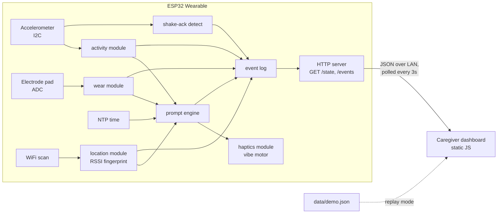

# Routine Anchor — Build Spec

ESP32 wearable for people with dementia/TBI. Gentle haptic prompts tied to time + room-level location, with a caregiver dashboard. Local-first: data never leaves the home network. ~$15 of parts.

---

## 1. System architecture



One integration seam matters more than everything else: **the JSON contract between firmware and dashboard** (§5). Freeze it in the first hour; both halves build against it independently.

**GitHub Pages constraint (important):** Pages is static hosting over HTTPS. It cannot receive POSTs from the ESP32, and an HTTPS page is blocked by browsers from fetching `http://<esp32-ip>` (mixed content / private network access). So the dashboard is one set of static files running in two modes:

- **Live mode** — same files opened locally (`python -m http.server` or the repo checkout) during the demo, polling the ESP32 over the LAN via HTTP. This is what judges see live.
- **Replay mode** — the GitHub Pages deployment, which loads `data/demo.json` (a captured event log) and animates it. This is what judges see when they open the link later. Auto-fallback: if the ESP32 fetch fails, switch to replay and show a banner.

This split is a feature, not a hack — it's literally the "local, no cloud" pitch. Say so on the slide.

---

## 2. Repo layout

```
routine-anchor/
├── README.md                  # pitch summary, wiring photo, quickstart, link to Pages
├── docs/                      # ← GitHub Pages root (Settings → Pages → main /docs)
│   ├── index.html
│   ├── css/style.css
│   ├── js/
│   │   ├── api.js             # data source abstraction: live vs replay
│   │   ├── app.js             # boot, poll loop, mode switching
│   │   ├── checklist.js       # today's routine checklist
│   │   ├── timeline.js        # activity/room timeline strip
│   │   └── alerts.js          # alert feed (wander, removal, missed prompt)
│   ├── data/demo.json         # captured event log for replay mode
│   └── img/                   # wiring diagram, photos (shared with README)
├── firmware/
│   ├── platformio.ini         # (or routine_anchor.ino if Arduino IDE)
│   └── src/
│       ├── main.cpp           # setup + single tick loop
│       ├── config.h           # WiFi creds, pins, schedule table, room fingerprints
│       ├── state.h            # DeviceState struct + Event struct (the shared types)
│       ├── activity.{h,cpp}   # resting/moving/sleeping + wander flag + shake-ack
│       ├── location.{h,cpp}   # RSSI fingerprinting (stubbable)
│       ├── wear.{h,cpp}       # electrode contact detection
│       ├── prompts.{h,cpp}    # scheduler + gating logic
│       ├── haptics.{h,cpp}    # vibe motor patterns
│       ├── events.{h,cpp}     # ring-buffer event log
│       └── server.{h,cpp}     # HTTP endpoints + CORS
├── hardware/
│   ├── wiring.md              # pin table + Fritzing/hand-drawn diagram
│   ├── bom.md                 # parts + cost (the "$15" claim, itemized)
│   └── enclosure/             # STL or "cardboard + tape" photos
├── tools/
│   ├── fingerprint_trainer.py # serial capture: label RSSI scans per room → config.h table
│   └── capture_demo.py        # poll /events during a real run → docs/data/demo.json
└── pitch/
    └── slides.pdf
```

---

## 3. Firmware modules

Single-threaded `loop()` with `millis()` timers. No RTOS tasks, no interrupts beyond what libraries need. Every module exposes `init()` + `tick()` + a getter; `main.cpp` owns a global `DeviceState` and calls modules in a fixed order.

### state.h (shared types — write this first)
```cpp
enum Activity { SLEEPING, RESTING, MOVING };
enum Room { UNKNOWN, KITCHEN, BEDROOM, LIVING };  // match config table

struct DeviceState {
  Activity activity;
  Room room;
  bool worn;
  bool wanderFlag;          // motion 00:00–05:00
  int8_t rssiConfidence;    // 0–100, for the demo slide
  uint32_t pendingPromptId; // 0 = none
};

struct Event {
  uint32_t id;              // monotonic
  time_t ts;
  const char* type;         // see event vocabulary §5
  const char* detail;
};
```

### activity — accelerometer classification
- I2C accel (MPU-6050 class assumed; adjust if different).
- 10 Hz sampling, 5 s sliding window of movement magnitude (|a| − 1g, filtered).
- Thresholds: below T1 for 20+ min → `SLEEPING`; below T1 → `RESTING`; above T1 → `MOVING`. Tune T1 on-wrist, hardcode.
- Wander flag: `MOVING` between 00:00–05:00 → emit `wander` event (once per episode, 30 min cooldown).
- **Shake-ack**: 3+ high-magnitude peaks within 1.5 s → `ackDetected()` returns true. Lives here because it owns the accel; prompt engine consumes it.

### location — RSSI fingerprinting *(stubbable — see cut order)*
- Every 15 s: `WiFi.scanNetworks()`, build vector of {BSSID → RSSI} for the 5–8 strongest APs.
- Match against per-room reference vectors in `config.h` (captured with `tools/fingerprint_trainer.py`): nearest neighbor, Euclidean distance over shared BSSIDs, missing AP = −100 dBm.
- Require margin between best and second-best match, else hold previous room. Debounce: 2 consecutive agreeing scans before emitting `room_change`.
- **Stub**: `getRoom()` returns `UNKNOWN`; prompt engine's location gate auto-passes when room is `UNKNOWN`. This makes the fallback (time-only prompts) a config behavior, not a code rewrite.
- Accuracy caveat for slides: this is room-*guess*, not room-*truth*. Say "room-level estimate," show the confidence number, don't claim precision you haven't measured.

### wear — electrode contact
- Electrode pad on ADC pin, simple divider circuit. Worn skin contact → reading in a band; open circuit → rail.
- 5 s debounce both directions. Emit `wear_on` / `wear_off` events.
- Do **not** derive heart rate or "stress" from this for v1. If you capture a pulse-looking signal, slide language is "elevated heart rate," never "detects agitation" — one pad + hackathon noise won't support the stronger claim.

### prompts — the product
- Schedule table in `config.h`: `{hour, minute, label, requiredRoom (or ANY), gate}`.
- Gate logic per tick: time reached AND `worn` AND `activity != SLEEPING` AND (room matches OR requiredRoom == ANY OR room == UNKNOWN-with-stub).
- Fire → `haptics.pulse(GENTLE)`, set `pendingPromptId`, emit `prompt_fired`, start 60 s ack window.
- Shake within window → `prompt_acked`. Timeout → re-buzz once, then `prompt_missed` (dashboard alert). Snooze-if-not-worn: hold prompt until wear resumes, up to 30 min.
- Manual trigger endpoint `POST /demo/fire` (see server) so the live demo doesn't depend on the wall clock.

### haptics
- Vibe motor on GPIO via NPN transistor + flyback diode (motor is inductive — don't drive it bare off the pin).
- Patterns: `GENTLE` (2 × 400 ms), `REMIND` (3 × 200 ms). PWM at ~60% duty so it's a nudge, not an alarm — the "gentle" in the pitch is a firmware constant.

### events
- Ring buffer, 200 entries, monotonic `id`. `since=<id>` query support. RAM-only is fine for a demo; note "no persistence across reboot" in README.

### server
- `WebServer` (or ESPAsyncWebServer) on port 80:
  - `GET /state` → current `DeviceState` as JSON
  - `GET /events?since=<id>` → array of events after id
  - `POST /demo/fire?id=<n>` → force a scheduled prompt now (demo insurance)
- CORS header `Access-Control-Allow-Origin: *` on everything — the dashboard is served from a different origin in both modes.
- Time via NTP at boot (WiFi is required anyway for RSSI). Fallback if venue blocks NTP: `POST /time` from the dashboard on connect.

---

## 4. Dashboard modules (`docs/`)

Plain HTML/CSS/JS, no build step — it must run from `file://`-adjacent local serving *and* from Pages unchanged. No frameworks; you don't have the hours.

- **api.js** — the only file that knows where data comes from.
  - `?device=192.168.x.x` URL param → live mode, poll `GET /state` (3 s) + `GET /events?since` (3 s).
  - No param, or 3 consecutive fetch failures → replay mode: load `data/demo.json`, play events on a timer, banner: "Replay of a recorded session — live device runs on the home network only."
  - Exposes one interface to the rest: `onState(cb)`, `onEvent(cb)`. Checklist/timeline/alerts never know which mode they're in.
- **checklist.js** — renders the schedule; `prompt_acked` checks items off, `prompt_missed` marks them red.
- **timeline.js** — horizontal day strip: activity color bands, room labels, wear gaps hatched.
- **alerts.js** — reverse-chron feed for `wander`, `wear_off`, `prompt_missed`. These three are the only alert types; resist adding more.
- **app.js** — boots api.js, wires callbacks, handles the mode banner and a "device: connected/last seen" indicator.

Schedule duplication note: the schedule lives in `config.h` (firmware truth) and is mirrored in a small JS constant for checklist rendering. Two sources of truth is ugly but correct for the timebox; "schedule editing from dashboard" goes on the *what's next* slide.

---

## 5. The data contract (freeze in hour 1)

`GET /state`:
```json
{
  "ts": 1758290400,
  "activity": "moving",
  "room": "kitchen",
  "roomConfidence": 82,
  "worn": true,
  "wanderFlag": false,
  "pendingPrompt": null
}
```

`GET /events?since=41`:
```json
{ "events": [
  { "id": 42, "ts": 1758290400, "type": "prompt_fired",  "detail": "meds_9am" },
  { "id": 43, "ts": 1758290421, "type": "prompt_acked",  "detail": "meds_9am" },
  { "id": 44, "ts": 1758291000, "type": "wear_off",      "detail": "" },
  { "id": 45, "ts": 1758291300, "type": "room_change",   "detail": "bedroom" }
]}
```

Event vocabulary (complete, do not grow it mid-hack): `prompt_fired`, `prompt_acked`, `prompt_missed`, `wear_on`, `wear_off`, `room_change`, `wander`.

`docs/data/demo.json` is exactly an `/events` array plus an initial state — so `tools/capture_demo.py` can record a real session and replay mode needs zero special-casing.

---

## 6. Integration points, in build order

1. **Hour 1: contract.** Write `state.h` + §5 JSON by hand. Dashboard dev codes against a hand-typed `demo.json` immediately; firmware dev codes against `curl`.
2. **Firmware internal:** modules only touch each other through `DeviceState` and the event log. Prompt engine reads getters; nothing calls across module files otherwise.
3. **Device ↔ dashboard:** HTTP polling only. No websockets, no MQTT, no push — polling every 3 s is invisible at demo scale and removes a whole failure class.
4. **Trainer ↔ firmware:** `fingerprint_trainer.py` reads scan dumps over serial, spits out a C array you paste into `config.h`. No filesystem, no upload flow.
5. **Repo ↔ Pages:** Pages serves `main` branch `/docs`. Pushing the repo *is* deploying the dashboard. `capture_demo.py` → commit `demo.json` → the public page shows your actual dry-run data.

**Venue network risk (real, plan for it):** hackathon/enterprise WiFi often has client isolation — laptop and ESP32 can't see each other even on the same SSID. Mitigation: run the demo on a phone hotspot (ESP32 + laptop both join it), and re-run the fingerprint trainer on-site since RSSI maps don't transfer between venues. Budget 20 min of the integration block for this.

---

## 7. Demo choreography → modules exercised

| Moment | Path through the system |
|---|---|
| Prompt fires, device buzzes, shake, checkbox ticks | prompts → haptics → activity(ack) → events → server → api.js → checklist.js |
| Peel device off, alert appears | wear → events → server → api.js → alerts.js |
| Walk between two rooms, location updates | location → events → server → api.js → timeline.js |

Rehearse with `POST /demo/fire` so moment 1 never waits on the clock. If venue WiFi dies mid-pitch, the Pages replay of your dry run is the parachute — mention it exists, don't lead with it.

---

## 8. Cut order → code impact

| Cut | What changes | What survives |
|---|---|---|
| 1. Electrode / wear | `wear.cpp` stub returns `worn=true`; dashboard hides wear UI | Everything else untouched |
| 2. RSSI localization | `location.cpp` stub returns `UNKNOWN`; gate auto-passes; prompts become time-only | Full prompt→ack→dashboard loop |
| Never | — | prompts + haptics + events + server + api.js + checklist.js |

The stubs are why modules exist as separate files: cutting is a one-line change, not surgery.

## 9. Time budget → modules

| Block | Hours | Files |
|---|---|---|
| Hardware + wear circuit | 4 | hardware/, wear.cpp, haptics wiring |
| Firmware | 6 | activity, location (**timeboxed: 2.5 h then stub**), prompts, events, server |
| Dashboard | 5 | docs/ everything, hand-typed demo.json first |
| Integration | 2 | contract conformance, hotspot test, on-site fingerprints, capture real demo.json |
| Pitch + rehearsal | 2 | pitch/, README, 3-moment run-through ×3 |
| Buffer | 1 | — |
