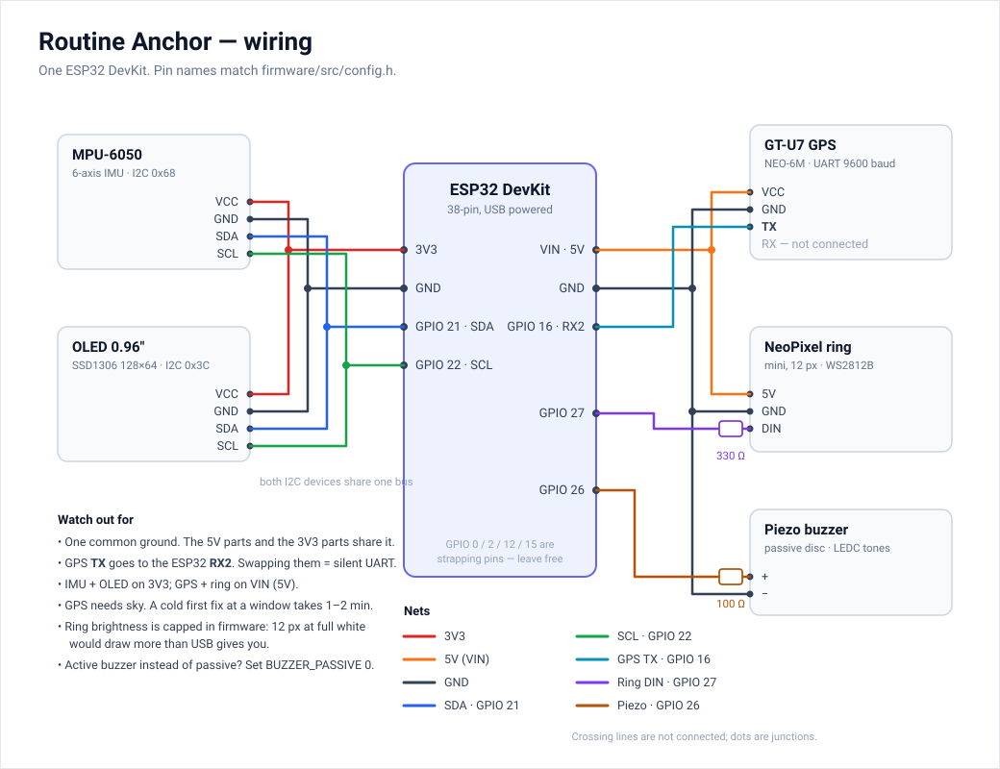

# Hardware wiring

Everything is one ESP32 DevKit. No second board, no hub.

*Source: [`docs/img/wiring.svg`](../docs/img/wiring.svg) — editable text, so pin changes are a one-line edit.*

| Part | Connection | Pin (`firmware/src/config.h`) |
|---|---|---|
| MPU-6050 (accel + gyro) | I2C, addr `0x68` (AD0 low) | SDA `GPIO 21`, SCL `GPIO 22`, VCC 3V3, GND |
| UCTRONICS 0.96" OLED (SSD1306 128x64) | same I2C bus, addr `0x3C` | SDA `GPIO 21`, SCL `GPIO 22`, VCC 3V3, GND |
| GT-U7 GPS receiver | UART2, 9600 baud | GPS **TX** → ESP32 `GPIO 16` (RX2), GPS RX → `GPIO 17` (optional), VCC 5V (VIN), GND |
| NeoPixel ring (mini, 12 px) | one data line | DIN → 330 Ω → `GPIO 27`, 5V (VIN), GND |
| Piezo buzzer | PWM tone (LEDC) | `GPIO 26` → piezo → 100 Ω → GND |

## Notes that will bite you

- **Common ground.** The ring and the GPS run off 5V/VIN while the ESP32 logic is 3V3. All grounds must be the same net, or the ring flickers and the GPS emits garbage.
- **GPS TX, not RX.** The GT-U7's labels are from the module's point of view: its TX goes to the ESP32's RX. Swapping them gives a silent UART, which `test_gps_module_is_talking` reports as "nothing on the GPS UART".
- **GPS needs sky.** Indoors it may never fix; a cold start at a window takes 1-2 minutes. The firmware runs fine without a fix — no geofence, prompts still fire.
- **GPIO 16/17** are free on a plain ESP32 DevKit. On modules with PSRAM (ESP32-WROVER) they are not: move the UART pins if you are on a WROVER.
- **Ring brightness** is capped in firmware (`LED_BRIGHTNESS 40`). At full white, 12 pixels draw ~700 mA, more than a USB port will give you — and this is a device someone wears at night.
- **Piezo type.** A passive piezo (bare disc, or a 2-pin module with no oscillator) plays the tone patterns. An active buzzer only does on/off: set `BUZZER_PASSIVE 0` in `config.h` and the same patterns play as rhythm at its fixed pitch.
- **Strapping pins.** Avoid GPIO 0, 2, 12, 15 for anything new: the board may refuse to boot with something pulling on them.

## Power

USB is fine for the demo. On a battery the GPS is the biggest continuous draw (~30 mA)
and the ring is the spikiest. Nothing here sleeps: `loop()` runs continuously.

## What is not in this build

No vibration motor and no electrode pad. The wearer's feedback is the piezo, the ring
and the OLED; "is it being worn" is inferred from IMU micro-motion instead of skin
contact (see `firmware/src/wear.cpp`).
